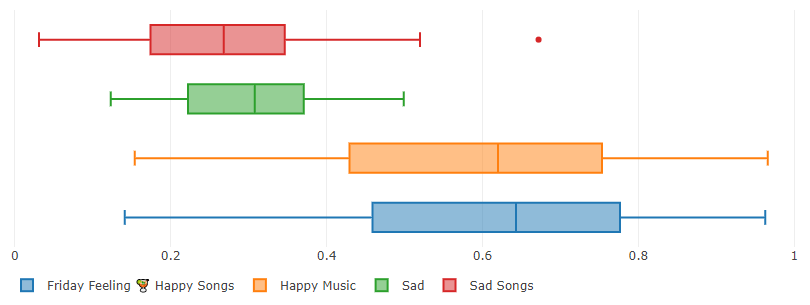
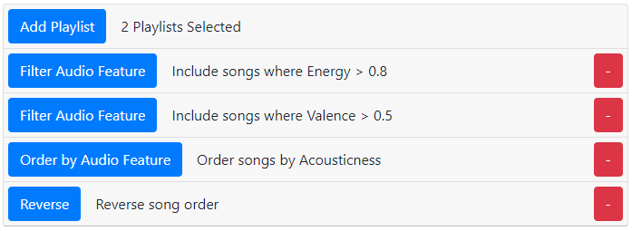

    
    
Create emotionally gradiented Spotify playlists and more.

    <a href="https://emotionify.nitratine.net/"><button class="btn btn-outline-secondary" type="button">🌐 Visit emotionify.nitratine.net →</button></a>

## Sorting Playlists
Emotionfy is a web app that allows users to easily sort their playlists using Spotify's pre-calculated audio feature values. By default, this project aims to create emotionally gradiented Spotify playlists for smoother emotional transitions. It does this by sorting songs based on the two features `Valence` and `Energy` [calculated by Spotify](https://developer.spotify.com/documentation/web-api/reference/tracks/get-audio-features/) based on distance from the origin.

Users have the option to change what songs are sorted by and how they are sorted. It is also possible to select more than one playlist when sorting songs. Below is a visualisation of one of my playlists being sorted:

## Comparing Playlists
By selecting any number of playlists, a user can compare them one or two dimensions for any audio feature or seven dimensions for specific audio features.

This can help you identify similar playlists and see what is different about a playlist's tracks on average using audio features calculated by Spotify.

## Playlist Tools
Select playlists and add filters in a sequence to create a more focused playlist.

This allows you to perform functions like sort by an audio feature, reverse and filter by an audio feature value to produce a playlist for any occasion.

