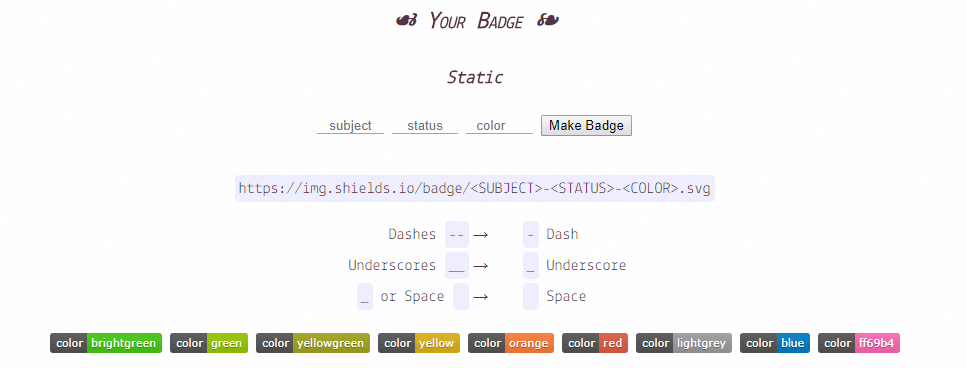

After recently making my project [hit-counter](/blog/post/hit-counter/) public, I was about to make a part to create your own custom badges to the project until I discovered [shields.io](https://shields.io/).

shields.io is a server built using JavaScript to host "Concise, consistent, and legible badges in SVG and raster format" which can be [found on Github](https://github.com/badges/shields). A lot of repositories with README.md files contain badges these days as they provide useful and interesting information.

In this tutorial, I will show you how to create your own and some dynamic ones hosted by shields.io.

## Creating Your Own Static Badges

Going to [shields.io/#your-badge](https://shields.io/#your-badge) you will be brought down the page to a tool that lets you create your own badges. This is quite helpful if you want to make a static badge that either relies on human input or just doesn't change.



Entering a value in `subject` will provide the text for the left, `status` the value for the right and `color` the colour of the right part of the badge.

For example, if I wanted to create a badge that says "made with" and then "python" with a blue background, I would do:

```html

```

Which will give you: 

You can also use hex colour codes instead of names, for example:

```html

```

This will give: 

## Styles

Five different styles are also available to use. These are:

- Plastic (?style=plastic) 
- Flat (?style=flat) 
- Flat Square (?style=flat-square) 
- For The Badge (?style=for-the-badge) 
- Social (?style=social) 

To apply these styles to a badge, simple add `?style=` to the end of the url and then add the style type as shown in the brackets above.

For example, using my badge from before:

```html

```

Will create: 

## Dynamic Badges

When visiting [shields.io](https://shields.io/) you will be introduced with a huge site of dynamic badges that the project supports. Here are a few badges that I like or find useful.

Remember there are many more badges on shields.io than what is displayed here. This is just a teaser and small examples of what is to offer.

### Github

Current GitHub tag: 

`https://img.shields.io/github/tag/expressjs/express.svg`

GitHub issues: 

`https://img.shields.io/github/issues/badges/shields.svg`

GitHub contributors: 

`https://img.shields.io/github/contributors/cdnjs/cdnjs.svg`

License: 

`https://img.shields.io/github/license/mashape/apistatus.svg`

GitHub code size in bytes: 

`https://img.shields.io/github/languages/code-size/badges/shields.svg`

GitHub top language: 

`https://img.shields.io/github/languages/top/badges/shields.svg`

GitHub language count: 

`https://img.shields.io/github/languages/count/badges/shields.svg`

### Social

GitHub forks: 

`https://img.shields.io/github/forks/badges/shields.svg?style=social`

GitHub stars: 

`https://img.shields.io/github/stars/badges/shields.svg?style=social`

GitHub watchers: 

`https://img.shields.io/github/watchers/badges/shields.svg?style=social`

GitHub followers: 

`https://img.shields.io/github/followers/espadrine.svg?style=social`

Twitter URL: 

`https://img.shields.io/twitter/url/http/shields.io.svg?style=social`

Twitter Follow: 

`https://img.shields.io/twitter/follow/espadrine.svg?style=social&label=Follow`

## Additional Options

shields.io has also provided some parameters we can pass to allow for some customisation. To add these to the badge, just put `...svg?parameter=value`. If you already have a parameter, you can chain them using `&`.

For example, from `.svg?style=flat-square` to `.svg?style=flat-square&label=Tag&colorA=ff69b4`

> Make sure to encode the uri before requesting. This can be done with the `encodeURIComponent()` method in JavaScript. For example encodeURIComponent(' ') is '%20'.

**`?label=healthinesses` : Override the default left-hand-side text**

 will become 

**`?logo=appveyor` : Insert one of the [named logos](https://github.com/badges/shields/tree/gh-pages/logo)**

 will become 

**`?logo=data:image/png;base64,…` : Insert custom logo image (≥ 14px high)**

No example as the data for the png will be large.

**`?logoWidth=40` : Set the horizontal space to give to the logo**

 will become 

**`?link=http://left&link=http://right` : Specify what clicking on the left/right of a badge should do**

No example as I use img to embed these images (You can use an &lt;object&gt; tag if you want to embed these).

**`?colorA=abcdef` : Set background of the left part (hex color only)**

 will become 

**`?colorB=fedcba` : Set background of the right part (hex color only)**

 will become 

**`?maxAge=360` : Set the HTTP cache lifetime in secs**

 will become 
