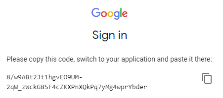
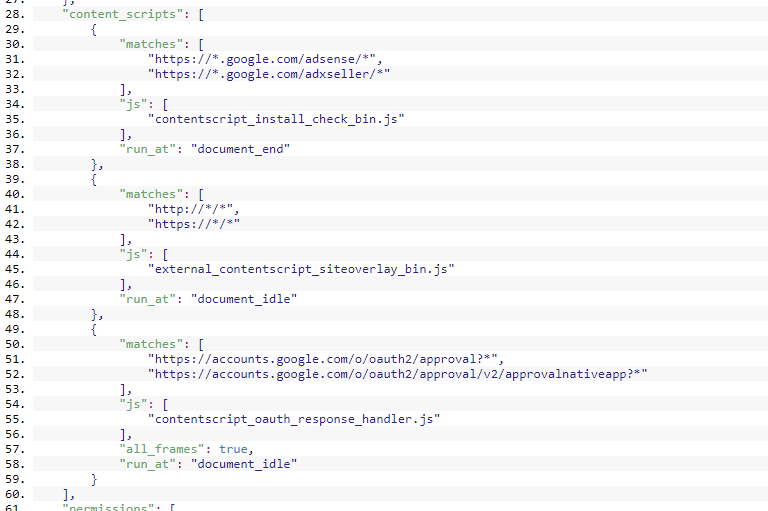
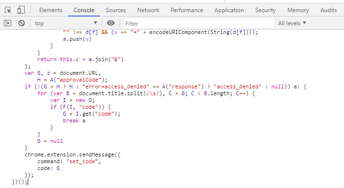

[TOC]

## The Problem
When installing the latest version of the Chrome extension *Google Publisher Toolbar* and then trying to connect/enable Google AdSense or Google Analytics, you may be given a prompt to "**Please copy this code, switch to your application and paste it there:**" followed by a code that you can copy like in the image below.



After quite a bit of digging, I couldn't find any solutions to this problem which meant I had to investigate the issue from the start.

> Please note that these steps described in this post may not work for everyone. These are the steps I took and they seem reliable; however, file names and contents can change.

My first thought was that something should be picking this code up automatically, in particular the Google Publisher Toolbar extension. Chrome extensions use JavaScript which can easily be viewed using some sort of extension viewer. 

## A Potentially Quick Solution
While testing the method below, it appeared to me that this script was being executed too fast on page load. In some cases, I found that simply refreshing the page that asks you to copy the code out will trigger the script to run again and thus take the token.

I cannot guarantee this method will have better accuracy than the last method but it's still worth a shot.

## Looking at the Source of the Extension
There are a [few options](https://gist.github.com/paulirish/78d6c1406c901be02c2d) when trying to view a Chrome extensions source but I decided to take an online tool approach as it would streamline the process of extracting everything. I ended up using [robwu.nl/crxviewer/](https://robwu.nl/crxviewer/) which simply asks for the URL of a Chrome extension (plus some other options).


Providing it with the [URL of Google Publisher Toolbar on the Chrome Web Store](https://chrome.google.com/webstore/detail/google-publisher-toolbar/omioeahgfecgfpfldejlnideemfidnkc) and leaving all the other options as default, I then clicked "Open in this viewer" to view the source of the extension.

## Looking for what Should be Executed
When the source first loads, it may appear to have a lot of files, but many of them are translations for different languages. The best way to get a hint of what to look for is to look at the `manifest.json` file. Viewing this file gives details like the name, version, icons and what scripts are run where; this is definitely the place for insight into what I was looking for.

If you look back at the URL we were told to "**Please copy this code, switch to your application and paste it there:**" on, you would have noticed that it followed something like `https://accounts.google.com/o/oauth2/approval/v2/approvalnativeapp?...` *(yours may be different)*; this is good to remember as this is where a JavaScript script should have picked up the token.

In the `manifest.json` file, under the [`content_scripts`](https://developer.chrome.com/extensions/content_scripts) key is a list of objects that describe what files that run in the context of web pages at particular URLs.



Each object in this list contains a `matches` key; this contains a list of all the URL matches where particular scripts are allowed to run. In the same object under the `js` key is a list of all the scripts that can run on the matched URLs. In the screenshot above, the third object contains the following:

```json
{
    "matches": [
        "https://accounts.google.com/o/oauth2/approval?*",
        "https://accounts.google.com/o/oauth2/approval/v2/approvalnativeapp?*"
    ],
    "js": [
        "contentscript_oauth_response_handler.js"
    ],
    "all_frames": true,
    "run_at": "document_idle"
}
```

The URLs that can be matched in this content script object match the original URL we are looking for; `https://accounts.google.com/o/oauth2/approval/v2/approvalnativeapp?...` is matched by `https://accounts.google.com/o/oauth2/approval?*` *(\* means anything)*. This means the JavaScript in the `contentscript_oauth_response_handler.js` is what should be running.

Open this file by searching for it on the left. The file is averagely sized and has been compressed as all function names have been renamed. This isn't an issue though as all the code is this file is wrapped in `(function() { <code> })();` which will mean this immediately gets executed when the script loads.

## Executing the JavaScript
Copy all the code from `contentscript_oauth_response_handler.js` onto the clipboard *(Ctrl + C)* and try to enable AdSense or Analytics in the Google Publisher Toolbar extension again. You should be presented with the *Please copy this code, switch to your application and paste it there:* page again; this is good as we haven't changed anything yet.

Press `F12` on this page to open Chrome dev tools. Go to the `Console` tab *(select it on the top bar)* and paste the code copied previously in this window.



After pasting the code, press enter. An error may be displayed with `Uncaught TypeError: Cannot read property 'sendMessage' of undefined`; ignore this and close the tab. Now when clicking on the Google Publisher Toolbar, you should see that the extension read the token and you can use Google Publisher Toolbar; repeat for the other service (AdSense/Analytics) if required.
