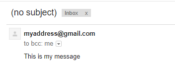
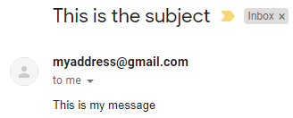
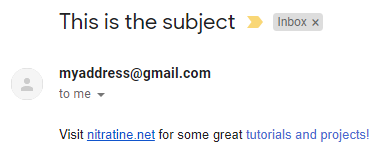

<youtube-video id="YPiHBtddefI"></youtube-video>

## Why Bother?

These scripts are used to send emails from a Gmail account (can be configured for other email servers). This will allow you to send emails when your script finishes executing, has come to an error or just needs to send some data to you.

This data could be anything, statistics of a website, crash reports or even files! This is particularly helpful for scripts running in the cloud or other places that take longer than 5 seconds to get access to. Getting reports sent straight to your email is convenient and can be helpful for storage. Python 3 is used in this tutorial.

## Before You Start

Before you start this, make sure you have your Gmail username and password ready. The account you are going to use must not have 2-Step Verification enabled as we will no longer be able to log in.

Next, go to [https://myaccount.google.com/lesssecureapps](https://myaccount.google.com/lesssecureapps) and log in if you need to. On this page, you will want to flick the Allow less secure apps switch to on. This allows us to use less secure sign-in technology to login to the email server; note that this will make your account more vulnerable.


> If you want/do have 2-Step Verification enabled, read up on how to [sign in using an app password](https://support.google.com/accounts/answer/185833). This allows you to generate a password specifically for this 'application' which allows this script to be compatible with a Google account using 2-Step Verification.

## Simple Email

To start, we will use the [smtplib module](https://docs.python.org/3/library/smtplib.html) which comes with python, so no need to install it using [pip](/blog/post/how-to-setup-pythons-pip/).

```python
import smtplib

email = 'myaddress@gmail.com' # Your email
password = 'password' # Your email account password
send_to_email = 'sentoaddreess@gmail.com' # Who you are sending the message to
message = 'This is my message' # The message in the email

server = smtplib.SMTP('smtp.gmail.com', 587) # Connect to the server
server.starttls() # Use TLS
server.login(email, password) # Login to the email server
server.sendmail(email, send_to_email , message) # Send the email
server.quit() # Logout of the email server
```

By changing the initial variables at the top, the email will be sent. Make sure to change:

- 'email' to your email address
- 'password' to your email address password
- 'send_to_email' to the email address you want to send the message to (can be the same as 'email')
- 'message' to what the message is you want to send



The image above shows the email that I received. It is very basic and has no subject line, we will add that next.

## Better Layouts

We will now add a subject, sender and receiver using the [email module](https://docs.python.org/3/library/email.html). This module is also already in python so no need to use pip.

```python
import smtplib
from email.mime.text import MIMEText
from email.mime.multipart import MIMEMultipart

email = 'myaddress@gmail.com'
password = 'password'
send_to_email = 'sentoaddreess@gmail.com'
subject = 'This is the subject' # The subject line
message = 'This is my message'

msg = MIMEMultipart()
msg['From'] = email
msg['To'] = send_to_email
msg['Subject'] = subject

 # Attach the message to the MIMEMultipart object
msg.attach(MIMEText(message, 'plain'))

server = smtplib.SMTP('smtp.gmail.com', 587)
server.starttls()
server.login(email, password)
text = msg.as_string() # You now need to convert the MIMEMultipart object to a string to send
server.sendmail(email, send_to_email, text)
server.quit()
```

Replacing the previous variables again and setting the new variable 'subject' to the subject line, the email will now send with a subject line when run.



The image above shows the email that I received. It now has a subject and has a `to` header if you click the little down arrow by 'me'.

## Attachments

There are quite a few ways to attach files to an email, but this is one of the simpler ways. This time we will use an encoder and MIMEMultipart from the email module and os.path to simply get the filename from the provided path.

This method supports text files, images, videos, audio and pdfs.

```python
import smtplib
from email.mime.text import MIMEText
from email.mime.multipart import MIMEMultipart
from email.mime.base import MIMEBase
from email import encoders
import os.path

email = 'myaddress@gmail.com'
password = 'password'
send_to_email = 'sentoaddreess@gmail.com'
subject = 'This is the subject'
message = 'This is my message'
file_location = 'C:\\Users\\You\\Desktop\\attach.txt'

msg = MIMEMultipart()
msg['From'] = email
msg['To'] = send_to_email
msg['Subject'] = subject

msg.attach(MIMEText(message, 'plain'))

# Setup the attachment
filename = os.path.basename(file_location)
attachment = open(file_location, "rb")
part = MIMEBase('application', 'octet-stream')
part.set_payload(attachment.read())
encoders.encode_base64(part)
part.add_header('Content-Disposition', "attachment; filename= %s" % filename)

# Attach the attachment to the MIMEMultipart object
msg.attach(part)

server = smtplib.SMTP('smtp.gmail.com', 587)
server.starttls()
server.login(email, password)
text = msg.as_string()
server.sendmail(email, send_to_email, text)
server.quit()
```

Once again, replacing the previous variables but setting the new variable 'file_location' to the location of the tile that you want to send, the email will now send with the file attached.


The image above shows the email that I received. It now has a file named 'test.py' that I declared in the script attached to the email.

## HTML in Emails

If you want to add things like links or CSS formatting to the email, you will need to prepare HTML text for the email.
Make another string which is the plain-text version of the HTML and then attach them both to the MIMEMultipart object to be sent later on.

```python
import smtplib
from email.mime.text import MIMEText
from email.mime.multipart import MIMEMultipart

email = 'myaddress@gmail.com'
password = 'password'
send_to_email = 'sentoaddreess@gmail.com'
subject = 'This is the subject'
messageHTML = '<p>Visit <a href="https://nitratine.net/">nitratine.net<a> for some great <span style="color: #496dd0">tutorials and projects!</span><p>'
messagePlain = 'Visit nitratine.net for some great tutorials and projects!'

msg = MIMEMultipart('alternative')
msg['From'] = email
msg['To'] = send_to_email
msg['Subject'] = subject

# Attach both plain and HTML versions
msg.attach(MIMEText(messagePlain, 'plain'))
msg.attach(MIMEText(messageHTML, 'html'))

server = smtplib.SMTP('smtp.gmail.com', 587)
server.starttls()
server.login(email, password)
text = msg.as_string()
server.sendmail(email, send_to_email, text)
server.quit()
```

As needed before, change the variables at the top but also messageHTML and messagePlain this time, the email will now be displayed using the HTML provided.



The image above shows that I received the email with the link and inline CSS colouring on the specified text.

## Sending to Multiple Emails

If you want to send the same email to many email addresses, the best method would be to first create all the objects you want in the email, login and then make each `MIMEMultipart` individually for each email.

```python
import smtplib
from email.mime.text import MIMEText
from email.mime.multipart import MIMEMultipart
from email.mime.base import MIMEBase
from email import encoders
import os.path

email = 'myaddress@gmail.com'
password = 'password'
send_to_emails = ['sentoaddreess@gmail.com', 'sentoaddreess2@gmail.com'] # List of email addresses
subject = 'This is the subject'
message = 'This is my message'
file_location = 'C:\\Users\\You\\Desktop\\attach.txt'

# Create the attachment file (only do it once)
filename = os.path.basename(file_location)
attachment = open(file_location, "rb")
part = MIMEBase('application', 'octet-stream')
part.set_payload(attachment.read())
encoders.encode_base64(part)
part.add_header('Content-Disposition', "attachment; filename= %s" % filename)

# Connect and login to the email server
server = smtplib.SMTP('smtp.gmail.com', 587)
server.starttls()
server.login(email, password)

# Loop over each email to send to
for send_to_email in send_to_emails:
    # Setup MIMEMultipart for each email address (if we don't do this, the emails will concat on each email sent)
    msg = MIMEMultipart()
    msg['From'] = email
    msg['To'] = send_to_email
    msg['Subject'] = subject

    # Attach the message to the MIMEMultipart object
    msg.attach(MIMEText(message, 'plain'))
    # Attach the attachment file
    msg.attach(part)

    # Send the email to this specific email address
    server.sendmail(email, send_to_email, msg.as_string())

# Quit the email server when everything is done
server.quit()
```

This method also makes sure that everyone that receives the email will not see the email of everyone else that the email was sent to. If you want to send one email to many addresses and let each recipient see who the email was sent to, you can simply set `msg['To']` to the recipient emails split by commas and then call `server.send_message` to send the email, passing `msg` not as a string.

```python
send_to_emails = ['recipient_1@gmail.com', 'recipient_2@gmail.com']

# Was: msg['To'] = send_to_email
msg['To'] = ', '.join(send_to_emails)

# Was: server.sendmail(email, send_to_email, text) where text = msg.as_string()
server.send_message(msg)
```

> These lines are examples of lines switched in examples above excluding the snippet in "Sending to Multiple Emails"

## Sources

- [WikiBooks](https://en.wikibooks.org/wiki/Python_Programming/Email)
- [naelshiab.com](https://naelshiab.com/tutorial-send-email-python/)
- [Python docs email examples](https://docs.python.org/3.4/library/email-examples.html)

_Most recently modified on 15-7-18 ( added video )_
