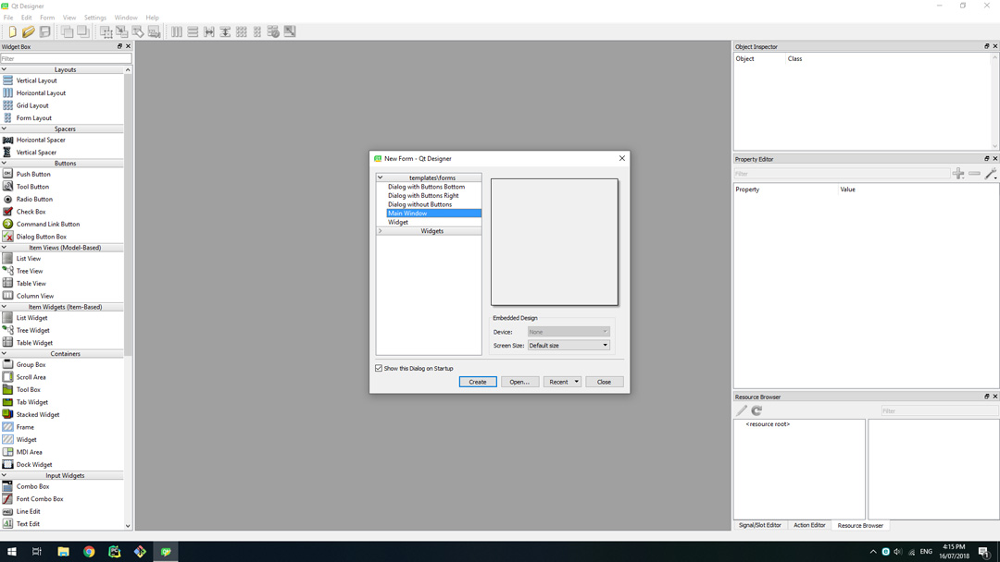
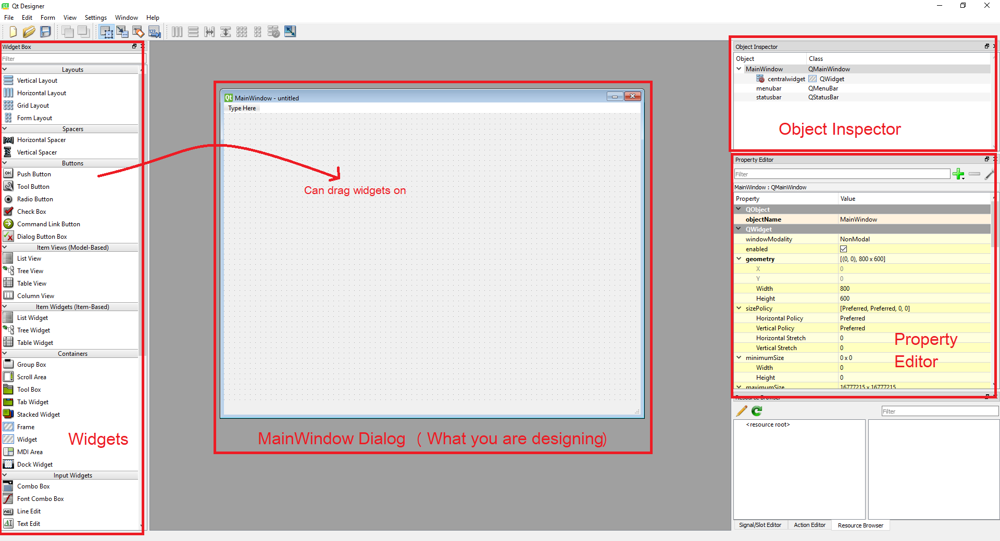
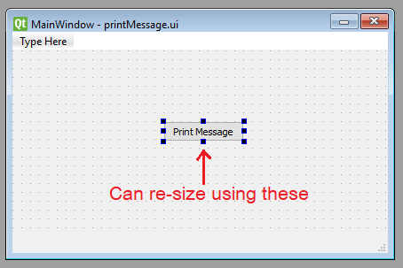
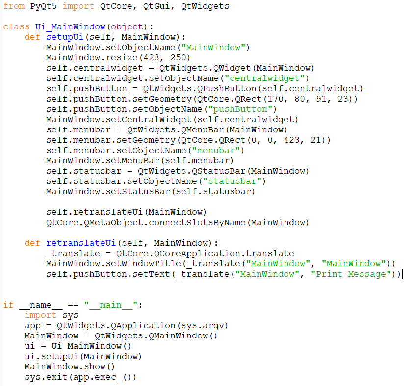
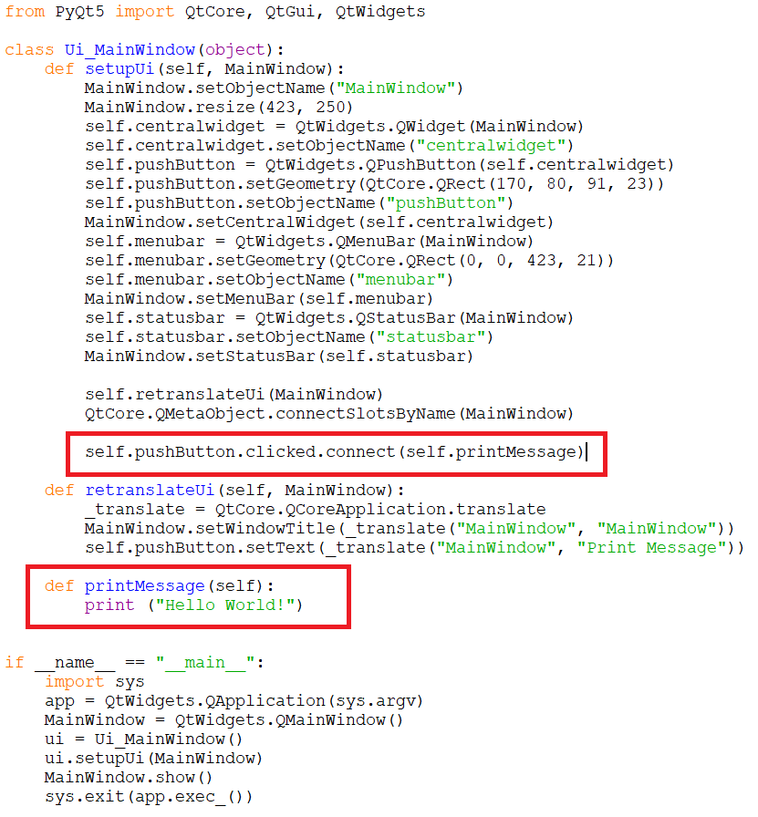
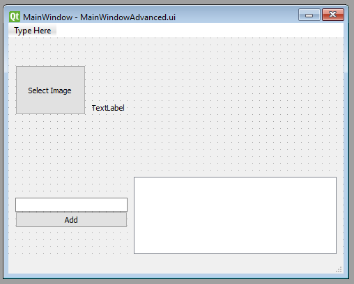
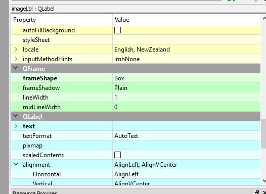
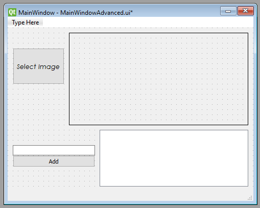
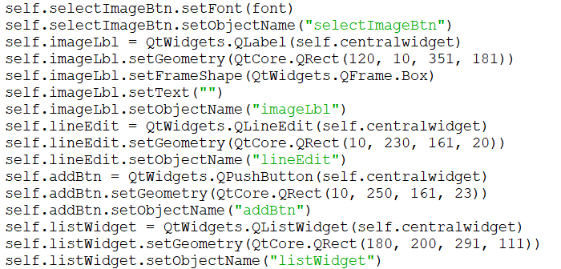

<youtube-video id="ksW59gYEl6Q"></youtube-video>

## Setting up the Environment

For this tutorial, you will need a version of Python equal to or above 3.5. I do however recommend to get a more recent version than 3.5 as I had issues with 3.5.2; a simple upgrade to 3.6.6 fixed this. If you don't know where to get Python, [look here](https://www.python.org/downloads/).

Now you will want to install pyqt5 and pyqt5-tools. To do this, we can use pip. Call the two commands `python -m pip install pyqt5` and `python -m pip install pyqt5-tools`. After each command completes, make sure to verify that they installed properly by checking if it says they were installed successfully.

You should now be able to execute the following in Python with no errors:

```python
import PyQt5
```

> If you have issues installing PyQt5 for some reason, you could try the installers at [its sourceforge page](https://sourceforge.net/projects/pyqt/files/PyQt5/PyQt-5.6/).

## Using the Designer

When you ran the `pip install pyqt5-tools` command, this installed tools that we can use to help with building GUIs.

### Locating

First, we need to locate where they are now, to do this we can run the following code in Python:

```python
import site
print (site.getsitepackages())
```

This will print out a couple of paths, for me it prints: `['C:\\Python36', 'C:\\Python36\\lib\\site-packages']`. Here we can see my Python distribution location and the site-packages folder. Open up a file explorer and navigate to the site-packages folder. In this folder, you then want to locate the `pyqt5-tools` folder and open it. In this folder, you should find a few files, one named designer.exe.

After recent updates to `pyqt5-tools`, designer.exe has been moved to the 'Scripts' folder in your Python distribution. To find this using the paths we found before, go to the first path returned ('C:\\Python36' in my case) and then go into the 'Scripts' folder; you should find designer.exe in here.

### Using the Designer

designer.exe is the program that we will use to make designing GUIs a lot easier; remember the location of this or create a shortcut to it and then run it (double click if you wish). You will be welcomed with a selection window; select "Main Window" and then click "Create".



You will now be shown an empty window in the middle of the designer's window with widget options on the left and some other windows to the right.

On the left, you can drag widgets from the drop-downs onto the MainWindow object in the centre. On the right, in the Object Inspector, you can see the current widgets in your window. Right below that is the Property Editor that allows you to modify the widget currently selected.



#### Creating a Simple Window

For this example, we will be just putting a button that prints "Hello World!" when pressed in the Window; soon we will work with a larger example when the basics are out of the way.

First, make your window a bit smaller by clicking and dragging the bottom right of the window (or any part on the edge) to change the size as you would do on any other window. Now find the "Push Button" widget under the Buttons section (on the left) and drag it into the window anywhere. You can double click on the button now to rename the text in it; set it to "Print Message".

You may now want to change the size of the button, to do this click on the button until there are blue squares on each of its corners and edges. Use these blue squares to re-size the button to a size you want.



When you are happy with what you have done (this is just a simple practice) then click File -> Save in the top left and save it somewhere where you will remember; I will save it as 'printMessage.ui' on my desktop.

_[Code download: printMessage.ui](printMessage.ui)_

## Converting .ui to .py

Now that we have our .ui file, we can convert it into Python code so we can modify and run it.

To do this we need to locate pyuic5. pyuic5 converts .ui to .py in one simple command and is located in the 'Scripts' folder in your Python distribution. If you don't know where this is, execute the following:

```python
import sys
import os
print (os.path.dirname(sys.executable))
```

You will be provided with a path of where your python distribution is located; mine is at `C:\Python36` (we saw this before when looking for the designer). Now go to this directory and open the 'Scripts' folder in there.

In this folder you will see a few executables to make Python in the terminal easier, you should also be able to see a file named `pyuic5.exe`; this is what we are going to use. Open cmd and then use the cd command to get to the directory; for example, I will execute `cd C:\Python36\Scripts` in cmd. Now if you type `pyuic5` you should be provided with a small error message saying "Error: one input ui-file must be specified"; this is good, we are in the right place.

To convert we now need to pass in the .ui file we created before and decide on an output filename and location. My .ui file is on my desktop currently so I will put the created .py file on the desktop also to make it easier. Now we can convert using `pyuic5 -x <.ui file> -o <output.py file>`, for example I will use `pyuic5 -x "C:\Users\Brent\Desktop\printMessage.ui" -o "C:\Users\Brent\Desktop\printMessage1.py"`. This should take not very long at all and show no errors; the python script you declared after -o will now exist - for me, a file called printMessage1.py is now on my desktop.

## Running the Output and Hooking up the Button

Now that you have the .py file containing the ui code, open it in IDLE or whatever IDE you use. Your code should look something like this:



_[Code download: printMessage1.py](printMessage1.py)_

Run the code and then wait for the GUI to appear; it currently won't do anything when you press the button so we will set that up.

Go back into the code for this GUI and look in the setupUi definition. You should see a class variable called `self.pushButton` which later has its text set to "Print Message" in the retranslateUi definition below. This is the object of our button that we need to make do something.

First, we need to create our method, this method can be in the global scope or in the class scope, for simplicity I will put it in the class scope. After the retranslateUi definition, create a new class called `printMessage` that takes self as an argument since it is part of the class now. Inside this put what you want the script do to when you press the button, for this example, I will print "Hello World!".

```python
def printMessage(self):
    print ("Hello World!")
```

Now that you have created the method to run, we can attach it to the button. Using the button variable we found before, we can call .clicked.connect() on it passing in the name of our method we just created (make sure to remember `self.` for class variables). Put this line at the bottom of the setupUi definition so it will be executed when the GUI is built.

```python
self.pushButton.clicked.connect(self.printMessage)
```

> Remember to not include () when passing the method here or it will not work.

Your script should now look something like this, don't worry if it is a bit different.



_[Code download: printMessage2.py](printMessage2.py)_

Run the code again and now when you press the button you should see that the script runs the code that you defined in the method you attached to the button.

## More Advanced Example

In this next example, I will show you how to put images in the GUI, add a selection dialog box and add data to a table.

### Creating Interface

Open the designer back up and create a new MainWindow. Now create and position the 5 widgets described below:

- Label (in Display Widgets): This label will be the widget we use to show the image
- PushButton (in Buttons): This button will allow us to select the image to show in the Label
- ListWidget (in Item Widgets): This will hold and display entries we add to it
- LineEdit (in Input Widgets): This will allow us to enter what we want into the table
- PushButton (in Buttons): This will add the item in the LineEdit to the table



If you click on a widget, for example, the button that will be selecting the button, the Property Editor on the right will display all the options for that object. In there you can edit things like the exact size/position, borders (frames), tooltips and fonts.

First, we will want to edit the Label that is holding the image; click on the label to open it up in the Property Editor. Find "text" under the QLabel section and delete the text, this is the same as double-clicking and removing the text. Now go to the QFrame heading and change "frameShape" to box, this will but a border around the image.



Now click on the select image button and in the QWidget header go to "font". This has many options inside of this so play around to get a font you like (you can leave it if you want). Your GUI should now look something like this:



To help you later on, you can also change the "objectName" under QObject in the Property Editor for all widgets so you can identify them easier later. Here is what I named mine:

- Select Image Button: selectImageBtn
- Image Label: imageLbl
- LineEdit: lineEdit
- Add button: addBtn
- ListWidget: listWidget

_[Code download: MainWindowAdvanced.ui](MainWindowAdvanced.ui)_

Like we did before, convert this .ui file (after saving it) to a .py file.

### Connecting Events to Methods

Now we need to connect all the actions together. The select image button will need to be connected to a method that displays an image selection dialog which will then put an image in the label. Also, we will need to make the 'add' button add the text in the lineEdit object into the listWidget object.

Your converted .py code should currently look something like this: _[Code download: MainWindowAdvanced1.py](MainWindowAdvanced1.py)_

If you open your .py file in IDLE, you can see that the names we gave each widget have passed through to the names of the actual objects. I also recommend running the code now to make sure it works.



#### Linking the Image Button

First, you will want to create a class definition called `setImage`; make sure this takes self as it is a class definition. In this method, we want to ask the user for an image (not just any file). If they provide a file, we then need to create a pixmap object and then set the pixmap object to the image label. Before we set it, it is ideal to scale the image to fit inside the label without stretching and aligning it to the centre. Your method will look like this:

```python
def setImage(self):
    fileName, _ = QtWidgets.QFileDialog.getOpenFileName(None, "Select Image", "", "Image Files (*.png *.jpg *jpeg *.bmp)") # Ask for file
    if fileName: # If the user gives a file
        pixmap = QtGui.QPixmap(fileName) # Setup pixmap with the provided image
        pixmap = pixmap.scaled(self.imageLbl.width(), self.imageLbl.height(), QtCore.Qt.KeepAspectRatio) # Scale pixmap
        self.imageLbl.setPixmap(pixmap) # Set the pixmap onto the label
        self.imageLbl.setAlignment(QtCore.Qt.AlignCenter) # Align the label to center
```

In the QtWidgets.QFileDialog.getOpenFileName method call, you can see I have passed the string `"Image Files (*.png *.jpg *jpeg *.bmp)"`. This declares the type of files I will accept. If you want to accept any file, remove this string completely. If you want to make it so the user could switch it to all files themselves, set it to `"Image Files (*.png *.jpg *jpeg *.bmp);;All Files (*)"`; play around with this to get the idea of what is going on, you can add more file extensions and selections if wanted.

Now we need to attach the button to the definition. This can simply be done using the connect method we used previously; make sure to put it at the bottom of the setupUi definition as we did before:

```python
self.selectImageBtn.clicked.connect(self.setImage)
```

Run the script and make sure that your button works. Initially, the label will be clear but each time you select a file it should change to the selected file.

#### Linking the Add to List Button

We will now need to create another class definition called `addItem` like before. In this method, we need to get the value of the lineEdit object and then clear it. We can then simply add the value we just got to the listWidget. After you have done that, the method should look like this:

```python
def addItem(self):
    value = self.lineEdit.text() # Get the value of the lineEdit
    self.lineEdit.clear() # Clear the text
    self.listWidget.addItem(value) # Add the value we got to the list
```

And then like before, we need to connect the button to the method just under the last one we did:

```python
self.addBtn.clicked.connect(self.addItem)
```

Running the script now you should be able to type in the text edit item and then press add for the item to go into the list.

_[Code download: MainWindowAdvanced2.py](MainWindowAdvanced2.py)_
