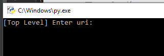

## What is this?
This project takes a Spotify playlist URI and will download its contents by sourcing audio from YouTube and tags/art from Spotify. YouTube videos for audio are found automatically.

## Demonstration and Screenshots

This is a console application, simply paste the URI and press enter.

## Requirements
* Python (tested with 3.5)
* ffmpeg (described in installation steps 5 and 6)

## Installation
1. Clone this repository. `git clone https://github.com/brentvollebregt/spotify-playlist-downloader.git`
2. cd into the project. `cd spotify-playlist-downloader`
3. Install the requirements. `pip install requirements.txt`
4. Go to [https://developer.spotify.com/my-applications](https://developer.spotify.com/my-applications) and create an app to get a client_id and client_secret key pair
5. Put these keys in settings.json
6. Go to [http://ffmpeg.zeranoe.com/builds/](http://ffmpeg.zeranoe.com/builds/) and download ffmpeg.
7. Extract the files from the zip and copy ffmpeg.exe, ffplay.exe and ffprobe.exe from the /bin folder to the location of spotify_album_downloader.py *(you can also put these in a location that is referenced by the PATH variable if you wish)*

## Usage
1. Get the URI of a Spotify playlist by clicking the three dots at the top to show then menu and click share. In this sub-menu, click "Copy Spotify URI"; this will copy the URI to your clipboard.
2. Run spotify_album_downloader.py and insert your Spotify URI, then hit enter.
3. Files will be saved to /output/ in the current working directory.
