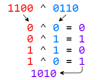

[TOC]

Previously doing a CTF challenge I found myself needing to XOR two byte strings in Python to reveal a key from the original text and 'ciphered' data (in this case by XOR).

## A Quick Introduction to XOR?
XOR (or "exclusive or") is a binary operator like AND and OR. In Python, bitwise XOR is represented as `^` like `&` is to AND and `|` is to OR. Here is a "truth table" using 1's and 0's:

| a | b | a ^ b |
|---|---|-------|
| 1 | 1 | 0     |
| 1 | 0 | 1     |
| 0 | 1 | 1     |
| 0 | 0 | 0     |

You can see that the result of the bitwise operation on two bits will be a 1 if they are different and 0 if they are the same. 

When applying this operator to values longer than one bit, each bit is compared with it's corresponding in the other value; for example:



It's also common to see this operator being used on numbers represented in binary, decimal and hex:

- `0b1100 ^ 0b0110` = 1010
- `5 ^ 10` = 15 *(0101 ^ 1010)*
- `0xF ^ 0x7` = 0x8  *(1111 ^ 0111)*

Even though my issue that I was trying to solve was using Python byte strings, I could still use the same principles...

## String XOR

I found [an answer on StackOverflow](https://stackoverflow.com/a/2612730/) showing how to XOR two strings to form a resulting string:

```python
def sxor(s1,s2):    
    return ''.join(chr(ord(a) ^ ord(b)) for a,b in zip(s1,s2))
```

Using this we could now do:

```python
key = sxor('string 1', 'string 2')
```

## Byte XOR

But this only worked for strings and I had a byte string. To fix this I simply removed the `ord` and `chr` calls to only manipulate bytes.

```python
def byte_xor(ba1, ba2):
    return bytes([_a ^ _b for _a, _b in zip(ba1, ba2)])
```

So now I could do

```python
key = byte_xor(b'string 1', b'string 2')
```

## My Original Problem
In the CTF challenge we were given this table: 

| Ciphertext in base64             | Plaintext                |
|----------------------------------|--------------------------|
| bVQwJ2M3K0pCIjQm                 | Test message             |
| ekghNjF6HVxSNiEqLjcZcisyLzYrV1Ym | Cyber Security Challenge |
| bVkmcyU2L14RKiBjMiddVSY9YzgrVV40 | The flag is hidden below |
| X10iNHk5fQ4HIGBxPnwPU3c=         | [REDACTED]               |

It was pretty easy to guess that the last row contained the flag and we could assume all the other rows used the same key. Since *[plaintext XOR key = cipher-text]* then *[cipher-text XOR plaintext = key]*; this meant I only need one cipher-text and it's corresponding plain text to get the key. Using Python, I could get the key using this method:

```python
import base64

base64_ciphertext = 'bVkmcyU2L14RKiBjMiddVSY9YzgrVV40'
plaintext = 'The flag is hidden below'

def byte_xor(ba1, ba2):
    """ XOR two byte strings """
    return bytes([_a ^ _b for _a, _b in zip(ba1, ba2)])
    
# Decode the cipher-text to a byte string and make the plaintext a byte string
key = byte_xor(base64.b64decode(base64_ciphertext), plaintext.encode())
```

The key produced from this was `91CSCZN91CSCZN91CSCZN91C`. We can see this repeats so we could say `91CSCZN` is the "base key" that repeats. Now to use this key on the final row, since `bxor` will zip to whatever byte string is the shortest, we do not have to make the key the correct size.

```python
import base64

base64_ciphertext = 'X10iNHk5fQ4HIGBxPnwPU3c='
key = '91CSCZN91CSCZN91CSCZN91C'

def bxor(ba1, ba2):
    """ XOR two byte strings """
    return bytes([_a ^ _b for _a, _b in zip(ba1, ba2)])

flag = bxor(base64.b64decode(base64_ciphertext), key.encode())
```

This gives `flag:c376c32d26b4`.
