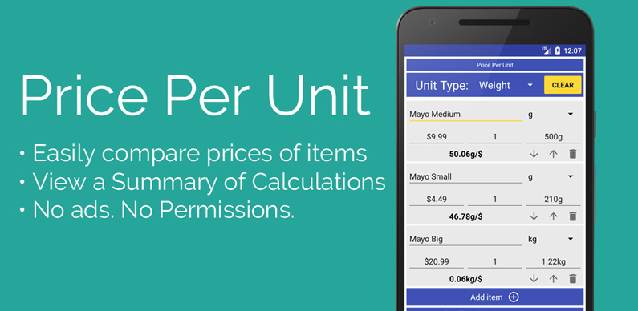

<div class="snippet">

## [Auto Py To Exe](https://github.com/brentvollebregt/auto-py-to-exe)

This project was my attempt at making the task of packaging Python scripts to Windows executables to run on computers without Python installed easier for new-comers.

This project allows someone to easily set up a server that uses chromes app mode as an interface and then calls PyInstaller with the parameters provided by the user.


This project can be installed from PyPI by executing:

```cmd
python -m pip install auto-py-to-exe
```

And then to run the project, simply call:

```cmd
auto-py-to-exe
```

> Associated [post](/blog/post/auto-py-to-exe/)

</div>
<div class="snippet">

## [Emotionify](https://emotionify.nitratine.net/)


Emotionify is a web app that allows users to login to Spotify,
select a playlist and then sort them using Spotify's pre-calculated audio
feature values.

By default, this project aims to create emotionally gradiented
Spotify playlists for smoother emotional transitions. It does this by
sorting songs based off the two features `Valence` and `Energy`
[calculated by Spotify](https://developer.spotify.com/documentation/web-api/reference/tr
acks/get-audio-features/) based on distance from the origin.

Users also have the ability to change how and what songs are sorted
by.


> Associated [post](/blog/post/emotionify/)

</div>
<div class="snippet">

## [Monopoly Money](https://monopoly-money.nitratine.net/)


Monopoly Money is a web app that helps you keep track of your
finances in a game of Monopoly.

Instead of using the cash that the game commonly comes with, you can
play Monopoly like you're playing the credit card edition, but with your
phone - a much more faster way to exchange money.

<div style="display: grid; grid-template-columns: repeat(3, 1fr); grid-gap: 6px;">
    <div></div>
    <div></div>
    <div></div>
</div>

> Associated [post](/blog/post/monopoly-money/)

</div>
<div class="snippet">

## [PyTutorials YouTube Channel](https://www.youtube.com/PyTutorials)


When I have time and ideas, I like to make programming tutorials.
Currently most of my tutorials are Python related but I also have a few
different ones.

Some of my videos have quite a bit of attention, for example:

- [Convert PY to EXE](https://youtu.be/lOIJIk_maO4): 600K+ views
- [Python GUI's with PyQt5](https://youtu.be/ksW59gYEl6Q): 200k+
  views
- [Python Keylogger](https://youtu.be/x8GbWt56TlY): 150k+ views
- [Record Your Computer Screen With
  VLC](https://youtu.be/H-6gxvBBEiw): 900k+ views

I give a significant amount of help in the comments for these videos
and try my best to find solutions for issues people are having. This also
allows me to gauge what people like in terms of topics and the videos
themselves and get great feedback.

</div>
<div class="snippet">

## [Spotify Lyrics Viewer](https://spotify-lyrics-viewer.nitratine.net/)


Spotify Lyrics Viewer is a tool that allows you to view the lyrics
of the current playing song on Spotify by simply signing into Spotify.

The tool provides a basic interface showing details about the
current playing song and lyrics sourced from Genius.


> Associated
> [post](blog/post/spotify-lyrics-viewer/)

</div>
<div class="snippet">

## [Who's On My Network](https://github.com/brentvollebregt/whos-on-my-network)


This tool helps you keep and eye on who is on your network and when.
It can periodically scan your network and you can then assign devices to
people and view who is on your network.

The tool provides a React interface to view scans that have been
made and identify unusual and unexpected activity.


> Associated [post](/blog/post/whos-on-my-network/)

</div>
<div class="snippet">

## [Price Per Unit](https://github.com/brentvollebregt/price-per-unit)



This project is an Android app that compares prices for similar items and will calculate the price per unit for each item. These values can then be compared to find the best value for money. Simply give a name (optional), enter in the cost, amount and size of each item and the unit per dollar will be calculated.

> Associated [post](/blog/post/price-per-unit/)

</div>
<div class="snippet">

## [nitratine.net](https://nitratine.net/)


Nitratine is a website where I share projects developed by me and
tutorials on topics that I'm interested in. Currently this is the fourth
version of the site and is hosted statically using GitHub Pages and built
using Gatsby.

The site also uses Netlify's CMS to make creating posts much easier but still
allows for raw JSX pages to be created to host more complex pages.

A GitHub Actions workflow is used to build the site on each push to master which
then deploys the most recent version of the site to GitHub pages.

</div>
